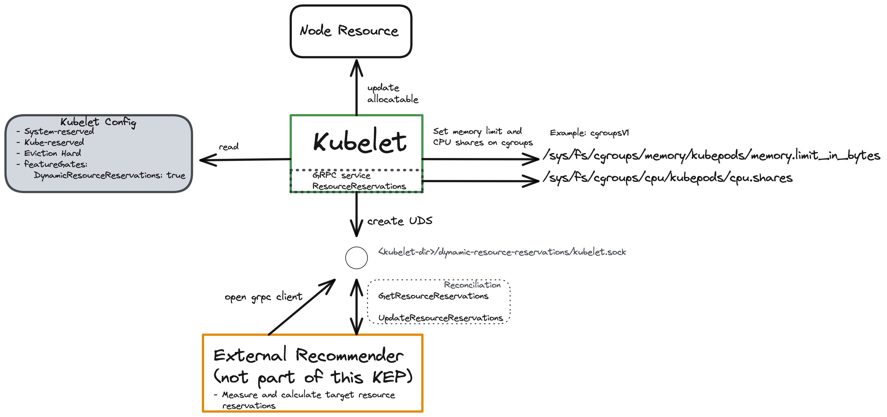

# KEP-NNNN: Dynamic Resource Reservations

- [Release Signoff Checklist](#release-signoff-checklist)
- [Summary](#summary)
- [Motivation](#motivation)
    - [Goals](#goals)
    - [Non-Goals](#non-goals)
- [Proposal](#proposal)
    - [User Stories (Optional)](#user-stories-optional)
        - [Story 1](#story-1)
        - [Story 2](#story-2)
    - [Notes/Constraints/Caveats (Optional)](#notesconstraintscaveats-optional)
    - [Risks and Mitigations](#risks-and-mitigations)
- [Design Details](#design-details)
    - [Test Plan](#test-plan)
    - [Graduation Criteria](#graduation-criteria)
    - [Upgrade / Downgrade Strategy](#upgrade--downgrade-strategy)
    - [Version Skew Strategy](#version-skew-strategy)
- [Production Readiness Review Questionnaire](#production-readiness-review-questionnaire)
    - [Feature Enablement and Rollback](#feature-enablement-and-rollback)
    - [Rollout, Upgrade and Rollback Planning](#rollout-upgrade-and-rollback-planning)
    - [Monitoring Requirements](#monitoring-requirements)
    - [Dependencies](#dependencies)
    - [Scalability](#scalability)
    - [Troubleshooting](#troubleshooting)
- [Implementation History](#implementation-history)
- [Drawbacks](#drawbacks)
- [Alternatives](#alternatives)
- [Infrastructure Needed (Optional)](#infrastructure-needed-optional)

## Release Signoff Checklist

Items marked with (R) are required *prior to targeting to a milestone / release*.

- [ ] (R) Enhancement issue in release milestone, which links to KEP dir in [kubernetes/enhancements](https://git.k8s.io/enhancements) (not the initial KEP PR)
- [ ] (R) KEP approvers have approved the KEP status as `implementable`
- [ ] (R) Design details are appropriately documented
- [ ] (R) Test plan is in place, giving consideration to SIG Architecture and SIG Testing input (including test refactors)
    - [ ] e2e Tests for all Beta API Operations (endpoints)
    - [ ] (R) Ensure GA e2e tests for meet requirements for [Conformance Tests](https://github.com/kubernetes/community/blob/master/contributors/devel/sig-architecture/conformance-tests.md)
    - [ ] (R) Minimum Two Week Window for GA e2e tests to prove flake free
- [ ] (R) Graduation criteria is in place
    - [ ] (R) [all GA Endpoints](https://github.com/kubernetes/community/pull/1806) must be hit by [Conformance Tests](https://github.com/kubernetes/community/blob/master/contributors/devel/sig-architecture/conformance-tests.md)
- [ ] (R) Production readiness review completed
- [ ] (R) Production readiness review approved
- [ ] "Implementation History" section is up-to-date for milestone
- [ ] User-facing documentation has been created in [kubernetes/website](https://git.k8s.io/website), for publication to [kubernetes.io](https://kubernetes.io/)
- [ ] Supporting documentation—e.g., additional design documents, links to mailing list discussions/SIG meetings, relevant PRs/issues, release notes

## Summary

The kubelet allows reserving resources (CPU, memory, ephemeral-storage, PID,...) for OS processes and Kubernetes daemons via system-reserved and kube-reserved (see Node Allocatable).
This configuration currently has to be set by the cluster provisioner in the kubelet configuration file **prior** to the startup of the kubelet.
Suitable kube-reserved and system-reserved values are typically derived by a function of the machine size and the maximum amount pods.
For examples, take a look at [GKE](https://cloud.google.com/kubernetes-engine/docs/concepts/cluster-architecture), [Azure](https://docs.microsoft.com/en-us/azure/aks/concepts-clusters-workloads#resource-reservations) and [OpenShift](https://github.com/openshift/enhancements/pull/642).

This KEP proposes a mechanism that allows to update the system-reserved and kube-reserved configuration of the kubelet at runtime without having to restart the kubelet process.
The kubelet exposes a grpc service via a Unix Domain socket (part of this KEP) which can be used by an 
external recommender / node-local process (not part of this KEP) to update the kube-reserved 
and system-reserved resources .

Related KEP: [KEP 2369 (Kubelet Sizing Providers)](https://github.com/kubernetes/enhancements/pull/2370)

## Motivation

The ability to update the resource reservations without a restart of the kubelet process (this KEP) allows an external `recommender` process to regularly reconcile 
the resource reservations based on the actually required reservation.

The advantages of accurate resource reservations are
1. Protection of the Node (non-pod processes such as kubelet + container runtime)
 - On Linux, prevent global/system-level OOMs which invoke the system OOM killer (instead of kubelet eviction or cgroup OOM) which can kill any process on the host
 - Prevent system processes from CPU starvation (kubepods has too many cpu.shares)
2. Protection of pod workload from unordered (not according to Kubernetes eviction order) termination
 - In case of a system-level OOM, the kubernetes-defined eviction order is not respected
 - kubelet eviction is only triggered close to the kubepods memory limit
3. Accurate resource reservations allow to safely increase utilisation

Additionally, when using cgroupsv2 with the kubelet feature gate `MemoryQoS` 
- a container has no memory limit defined, the kubelet calculates the memory usage throttling (`memory.high`) with the node allocatable multiplied with a throttling factor.
  The accuracy of the node allocatable has an effect on the accuracy of memory usage throttling for pods.
- the file `memory.min` for the kubepods and system.slice cgroups are set according to the kube/system-reserved values.
  The minimum non-reclaimable memory for system.slice depends on the usage of system processes and varies based on the pod workload (see below) 


### Background
The calculation of reserved resources done before node creation (typically as a function of the machine size) without exactly knowing the
deployed workload is an approximation that will either over-reserve or under-reserve resources for kubernetes and system-components.

Firstly, the CPU and memory consumption of the kubelet and container runtime relates to the number of pods **currently** deployed on the Node (not necessarily max pods).
Reason: 
- A larger amount of pods causes more kubelet activity (via CRI, state-of-the world, PLEG, housekeeping tasks, ...).
- Each pod has a shim process whose CPU and memory consumption is counted towards the container runtime's cgroup.

Secondly, the CPU and memory consumption of the container runtime depends on the deployed workload.
Example how pod log decoration influences required CPU reservations (for containerd):
1. Pod processes log to STDOUT (unnamed pipes).
2. The containerd-shim reads and forwards those logs to the CRI-containerd created FIFOS.
3. The containerd-daemon in turn continously reads from the FIFOs, decorates the logs according to the kubelet expected format.
4. Finally the containerd-cri writes the logs to `var/log/containers`.

This log-decoration mechanism demonstrates that pod workload influences the containerd deamons CPU consumption and therefore 
the required CPU reservation.

**Consequences of over reserving resources**

- Over reserving resources leads to lower utilization and higher costs.

**Consequences of under reserving Memory**

"Global/OS" OOM Killer hits instead of cgroup-level OOM killer on the kubepods cgroup.

- Any OS process (except `oom_score_adj` -1000) can potentially be killed including the container runtime and the kubelet
- OS lockups can happen (the kernel can spend an unbounded amount of time swapping in and out pages and evicting the page cache). There are even [user-level oom killers](https://github.com/facebookincubator/oomd) to prevent the system level OOM killer from becoming active.
- Kubelet eviction is not triggered as the eviction mechanism seems to only get triggered if the kubepods cgroup runs out-of-memory.

**Consequences of under reserving CPU**

- Processes outside kubepods cgroup do not get enough CPU time (cpu.shares) in case of resource contention. This leads to processes being CPU starved. This can lead to a variety of issues.


### Goals

Implement a mechanism to update the `kube-reserved` and `system-reserved` values during kubelet runtime without having to restart the kubelet.

### Non-Goals

The kubelet should not itself determine the target `kube-reserved` and `system-reserved` values.
This should be done externally, for example by a node-local daemon that monitors the system resources and then communicates with the kubelet that the reserved resources should be updated.
See [Considerations](#considerations).

Such *external recommender* is not part of this KEP.

## Considerations

### In-tree resource monitoring

**OS resource monitoring**

The kubelet could monitor the available resources of the OS, compute recommendations and directly update the reserved resources.
The advantage is simplicity because there is no client-server architecture needed.

The disadvantage is maintainability when supporting different Operating Systems.
On top of that, even between Operating Systems versions there can be different ways to determine the determine resource usage. 
For example, newer Linux versions contain the field `memoryAvailable` in `proc/meminfo` which 
can be used for calculating target reservations (if include [this commit](https://git.kernel.org/pub/scm/linux/kernel/git/torvalds/linux.git/commit/?id=34e431b0ae398fc54ea69ff85ec700722c9da773)) while older or other OS versions do not.

**Computing resource-reservation recommendations**

Similarly, the kubelet could fetch the resource usage from an external source and based on that calculate the resource-reservation recommendations.
However, in general it is desirable to divide the mechanism (update the resource-reservations) from the policy (how the recommendations are derived).
This allows the flexibility to update or add new policies without having to update the mechanism in the kubelet.
For instance, using a more-aggressive resource-reservation policy can be done simply by updating a `DaemonSet` that deploys the reserved resource recommenders.

Therefore, this KEP proposes that an external and OS-specific daemon monitors the OS's available resources and computes recommendations for resource reservation.

### Mechanism: Pull vs. Push

As established above, the kubelet should not be the component to monitor available resources. Hence, the knowledge when to increase the reserved resources is external to the kubelet.

One approach is for the kubelet to make requests against an API to *pull* new reserved resource values (such as proposed by KEP 2369 (Kubelet Sizing Providers)\](https://github.com/kubernetes/enhancements/pull/2370)).
Downsides of the *pull* approach

- Increases complexity of the kubelet by adding reconciliation logic and configuration compared to serving an API.
- No way for the kubelet to react to suddenly spiking resource usages that happen outside the reconciliation interval.

Therefore, this KEP proposes that the kubelet provides an endpoint that allows external components to *push* resource recommendations.

### Serving the API

The kubelet serves the `DynamicResourceReservations` API only node-local.
This is because, accurate resource reservations dependent on the freely available resources of the Node itself.
Hence, a node-local `recommender` agent is required to monitor and compute the desired resource reservations.
Exposing an additional API and port on the kubelet and distributing credentials can be avoided.

Communication between the `recommender` and the `DynamicResourceReservations` API is proposed to be done via IPC using grpc with a Unix Domain Socket.
Overall, this follows how the CRI and the [PodResources API](https://github.com/kubernetes/enhancements/tree/master/keps/sig-node/606-compute-device-assignment) are implemented.

## Proposal

### User Stories (Optional)

#### Story 1

#### Story 2

### Notes/Constraints/Caveats (Optional)

The implementation should check all code in the kubelet that uses kube/system-reserved values
- CPU manager
- MemoryQOS feature gate

Edge scenarios should be tested 
- what happens when the sum of all pod's resource requests is suddenly (due to changed reservations) larger than the node's allocatable? 
  Will this lead to evictions by the kubelet?


### Risks and Mitigations

| Risk | Impact | Mitigation |
| --- | --- | --- |
| Too many requests risk impacting the kubelet performances | High | Implement rate limiting and or passive caching, follow best practices for gRPC resource management. |
| Improper access to the data | Low | Server is listening on a root owned unix socket. This can be limited with proper filesystem permissions. |
| Havoc external process asking the kubelet to update to invalid `kube-reserved` or `system-reserved` values | High | Validate the proposed reserved resource values and reject if they are faulty. |
| Avoid workload disruptions due to pod evictions when the resource reservations are updated | High | It is a tradeoff similar to VPA which can cause disruptions when the pod is restarted. Reduce risk with safety logic in the kubelet. Example: Only accept updating CPU reservations that could lead to pod evictions if received repeatedly over X minutes. |

## Design Details

### Proposed API



We propose to add a new gRPC service `ResourceReservations` to the Kubelet. This gRPC service listens on a unix socket at `/var/lib/kubelet/dynamic-resource-reservations/kubelet.sock` .
It serves an API to update and list the current resource reservations.

```
// ResourceReservations is a service provided by the kubelet that allows to update and list the current
// resources reservations on the node.
service ResourceReservations {
  // UpdateResourceReservations allows to update the current reserved resources.
  rpc UpdateResourceReservations(UpdateResourceReservationsRequest) returns (UpdateResourceReservationsResponse) {}
  // GetResourceReservations allows to retrieve the current reserved resources.
  rpc GetResourceReservations(GetResourceReservationsRequest) returns (GetResourceReservationsResponse) {}
}

// UpdateResourceReservationsRequest is the message used for the UpdateResourceReservations function.
message UpdateResourceReservationsRequest {
  // system_reserved contains the desired system-reserved values.
  map<string, string> system_reserved = 1;
  // kube_reserved contains the desired kube-reserved values.
  map<string, string> kube_reserved = 2;
}

// UpdateResourceReservationsResponse is the response message of the UpdateResourceReservations function.
message UpdateResourceReservationsResponse {}

// GetResourceReservationsRequest is the message used for the GetResourceReservations function.
message GetResourceReservationsRequest {}

// GetResourceReservationsResponse is the response message of the GetResourceReservations function.
message GetResourceReservationsResponse {
  // system_reserved contains the current system-reserved values.
  map<string, string> system_reserved = 1;
  // kube_reserved contains the current kube-reserved values.
  map<string, string> kube_reserved = 2;
}
```

### Updating the kubelet configuration file

The kubelet configuration file should not be modified when the resource reservations are updated.
This allows for a rollback to the initially set `kube-reserved` and `system-reserved` values when disabling the feature gate.

To preserve previously set resource reservations via the `ResourceReservations` service during a kubelet restart, 
a `resource-reservations` state file (similar to the CPU Manager state file) can be used.
When restarting the kubelet with enabled feature gate `DynamicResourceReservations`, the kubelet uses the resource reservations from the `resource-reservations` state file
instead of using the `kube-reserved` and `system-reserved` values from the kubelet configuration file.


### Test Plan

### Graduation Criteria

### Upgrade / Downgrade Strategy

### Version Skew Strategy

## Production Readiness Review Questionnaire

### Feature Enablement and Rollback

###### How can this feature be enabled / disabled in a live cluster?

- [ ] Feature gate (also fill in values in `kep.yaml`)
    - [x] Feature gate name: `DynamicResourceReservations`
    - [ ] Components depending on the feature gate:
- [ ] Other
    - [ ] Describe the mechanism:
    - [ ] Will enabling / disabling the feature require downtime of the control
      plane?
    - [ ] Will enabling / disabling the feature require downtime or reprovisioning
      of a node? (Do not assume `Dynamic Kubelet Config` feature is enabled).

###### Does enabling the feature change any default behavior?

No.

###### Can the feature be disabled once it has been enabled (i.e. can we roll back the enablement)?

Yes. 
Disabling the feature gate causes the kubelet to again use the kube-reserved and system-reserved from the kubelet configuration file.

###### What happens if we reenable the feature if it was previously rolled back?

###### Are there any tests for feature enablement/disablement?

### Rollout, Upgrade and Rollback Planning

###### How can a rollout or rollback fail? Can it impact already running workloads?

###### What specific metrics should inform a rollback?

###### Were upgrade and rollback tested? Was the upgrade->downgrade->upgrade path tested?

###### Is the rollout accompanied by any deprecations and/or removals of features, APIs, fields of API types, flags, etc.?

### Monitoring Requirements

###### How can an operator determine if the feature is in use by workloads?

Look at the metrics exposed by the kubelet.

- `dynamic_resources_requests_list_requests`
- `dynamic_resources_requests_updates_requests`

Look at allocatable resources of Nodes.

###### How can someone using this feature know that it is working for their instance?

- [ ] Events
    - [ ] Event Reason:
- [ ] API .status
    - [ ] Condition name:
    - [x] Other field: The NodeAllocatable will be updated regularly and differs from the default or initially set configuration.
- [ ] Other (treat as last resort)
    - [x] Details: The kubelet logs updates to the kube- and system reserved values.

###### What are the reasonable SLOs (Service Level Objectives) for the enhancement?

###### What are the SLIs (Service Level Indicators) an operator can use to determine the health of the service?

- [ ] Metrics
    - [ ] Metric name:
    - [ ] \[Optional\] Aggregation method:
    - [ ] Components exposing the metric:
- [ ] Other (treat as last resort)
    - [ ] Details:

###### Are there any missing metrics that would be useful to have to improve observability of this feature?

### Dependencies

###### Does this feature depend on any specific services running in the cluster?

No. If there is no `recommender` agent in the cluster, the API is not used.

### Scalability

###### Will enabling / using this feature result in any new API calls?

No.

###### Will enabling / using this feature result in introducing new API types?

Yes.

###### Will enabling / using this feature result in any new calls to the cloud provider?

No.

###### Will enabling / using this feature result in increasing size or count of the existing API objects?

No

###### Will enabling / using this feature result in increasing time taken by any operations covered by existing SLIs/SLOs?

No

###### Will enabling / using this feature result in non-negligible increase of resource usage (CPU, RAM, disk, IO, ...) in any components?

No.

### Troubleshooting

###### How does this feature react if the API server and/or etcd is unavailable?

No impact as node-local.

###### What are other known failure modes?

###### What steps should be taken if SLOs are not being met to determine the problem?

## Implementation History

## Drawbacks

## Alternatives

Do not integrate with the kubelet and let the external recommender directly manipulate the cgroup settings.

Disadvantages
- kubelet works with an outdated-view of available resources on the node. 
  This can be problematic as the kubelet uses these resource reservations during its operations
   - the `MemoryQOS` feature uses the node's allocatable to calculate a cgroup's memory usage throttling limit (via`memory.high`)
- Both the external process and the kubelet overwrite each other's cgroup settings (on kubelet restart)
- External process needs to communicate with the kube-apiserver to update the Node's allocatable
- External process needs to distinguish between cgroupsv1 and cgroupsv2, which would otherwise be abstracted by the kubelet

## Infrastructure Needed (Optional)